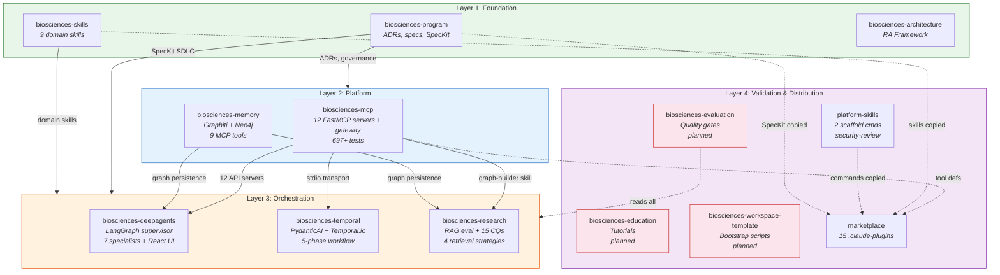

# Layered Architecture — Open Biosciences

## Platform Layer Diagram

## Layer Responsibilities

### Layer 1: Foundation (Root Providers)
- **No upstream dependencies** — consumed by everything
- biosciences-program: governance, ADRs, specs, migration coordination
- biosciences-skills: domain-specific research skills
- biosciences-architecture: Repository Analyzer Framework (analysis tooling)

### Layer 2: Platform (Infrastructure)
- **Depends on:** Layer 1 (ADR compliance, schema definitions)
- biosciences-mcp: 12 life sciences API wrappers in a unified gateway
- biosciences-memory: Graphiti knowledge graph with Neo4j persistence

### Layer 3: Orchestration (Applications)
- **Depends on:** Layers 1 + 2 (skills, MCP tools, graph persistence)
- biosciences-deepagents: interactive multi-agent research (LangGraph + React)
- biosciences-temporal: durable research pipelines (PydanticAI + Temporal)
- biosciences-research: RAG evaluation and competency question workflows

### Layer 4: Validation & Distribution
- **Depends on:** Layers 1-3 (observational, no runtime coupling)
- biosciences-evaluation: quality measurement (planned)
- biosciences-education: training content (planned)
- biosciences-workspace-template: bootstrap automation (planned)
- platform-skills: developer-facing scaffold commands
- marketplace: community-facing plugin distribution
