# Cross-Repo Dependency Graph — Open Biosciences

## Full Topology

```mermaid
graph TD
    %% Foundation layer
    PROG["biosciences-program<br/>Agent 1: Program Director"]
    SKILLS["biosciences-skills<br/>Agent 8: Quality & Skills"]
    ARCH["biosciences-architecture<br/>Agent 2: Platform Architect"]

    %% Platform layer
    MCP["biosciences-mcp<br/>Agent 3: MCP Platform Engineer<br/><b>12 servers | 697+ tests</b>"]
    MEM["biosciences-memory<br/>Agent 4: Memory Engineer<br/><b>Graphiti + Neo4j</b>"]

    %% Orchestration layer
    DEEP["biosciences-deepagents<br/>Agent 5: Deep Agents Engineer<br/><b>LangGraph + React UI</b>"]
    TEMP["biosciences-temporal<br/>Agent 7: Temporal Engineer<br/><b>PydanticAI + Temporal</b>"]
    RES["biosciences-research<br/>Agent 6: Research Workflows<br/><b>RAG + 15 CQs</b>"]

    %% Validation layer
    EVAL["biosciences-evaluation<br/>Agent 8"]
    EDU["biosciences-education<br/>Agent 9"]
    WSTP["workspace-template<br/>Agent 9"]
    PLAT["platform-skills<br/>Agent 8"]
    MKT["marketplace<br/>Agent 8<br/><b>15 plugins</b>"]

    %% Foundation → Platform
    PROG -->|ADR schemas| MCP
    PROG -->|entity types| MEM
    ARCH -->|ADR compliance| MCP

    %% Platform → Orchestration
    MCP -->|"HTTP gateway<br/>33 alias tools"| DEEP
    MCP -->|"Stdio transport<br/>MCP subprocess"| TEMP
    MCP -->|"graph-builder skill"| RES
    MEM -->|"persist_to_graphiti"| DEEP
    MEM -->|"group_id namespaces"| RES

    %% Foundation → Orchestration (skills)
    SKILLS -->|domain skills| DEEP
    SKILLS -->|domain skills| TEMP
    SKILLS -->|domain skills| RES

    %% Distribution edges (dashed)
    MCP -.->|tool defs| MKT
    SKILLS -.->|skills| MKT
    PLAT -.->|commands| MKT
    PROG -.->|SpecKit| MKT

    %% Evaluation (dashed, observational)
    EVAL -.->|observes| MCP
    EVAL -.->|observes| DEEP
    EVAL -.->|observes| RES

    %% Styling by layer
    style PROG fill:#c8e6c9,stroke:#2e7d32,stroke-width:2px
    style SKILLS fill:#c8e6c9,stroke:#2e7d32,stroke-width:2px
    style ARCH fill:#c8e6c9,stroke:#2e7d32,stroke-width:2px
    style MCP fill:#bbdefb,stroke:#1565c0,stroke-width:3px
    style MEM fill:#bbdefb,stroke:#1565c0,stroke-width:2px
    style DEEP fill:#ffe0b2,stroke:#e65100,stroke-width:2px
    style TEMP fill:#ffe0b2,stroke:#e65100,stroke-width:2px
    style RES fill:#ffe0b2,stroke:#e65100,stroke-width:2px
    style EVAL fill:#e1bee7,stroke:#7b1fa2,stroke-width:1px
    style EDU fill:#e1bee7,stroke:#7b1fa2,stroke-width:1px
    style WSTP fill:#e1bee7,stroke:#7b1fa2,stroke-width:1px
    style PLAT fill:#e1bee7,stroke:#7b1fa2,stroke-width:1px
    style MKT fill:#e1bee7,stroke:#7b1fa2,stroke-width:2px
```

## Dependency Matrix

Rows depend on columns. `R` = runtime, `D` = design-time (ADR/schema), `C` = copy (distribution), `O` = observational.

| | program | skills | arch | mcp | memory | deepagents | temporal | research | eval | platform-skills | marketplace |
|---|---|---|---|---|---|---|---|---|---|---|---|
| **program** | - | | | | | | | | | | |
| **skills** | D | - | | | | | | | | | |
| **architecture** | D | | - | | | | | | | | |
| **mcp** | D | | D | - | | | | | | | |
| **memory** | D | | | | - | | | | | | |
| **deepagents** | | R | | R | R | - | | | | | |
| **temporal** | | R | | R | | | - | | | | |
| **research** | | R | | R | R | | | - | | | |
| **evaluation** | | | | O | | O | | O | - | | |
| **platform-skills** | D | | D | | | | | | | - | |
| **marketplace** | C | C | | C | | | | | | C | - |

## Key Observations

1. **biosciences-mcp is the most-depended-upon runtime component** (3 direct consumers)
2. **biosciences-program is the most-depended-upon design-time component** (all repos)
3. **No circular dependencies exist** — the graph is a DAG
4. **marketplace has no downstream dependents** — it's a distribution endpoint
5. **evaluation has no downstream dependents** — it's observational only
