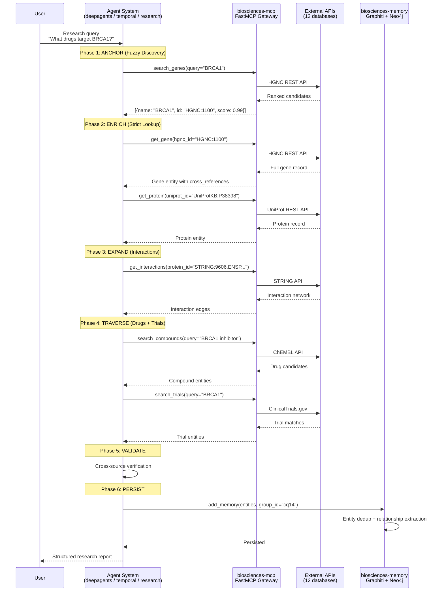
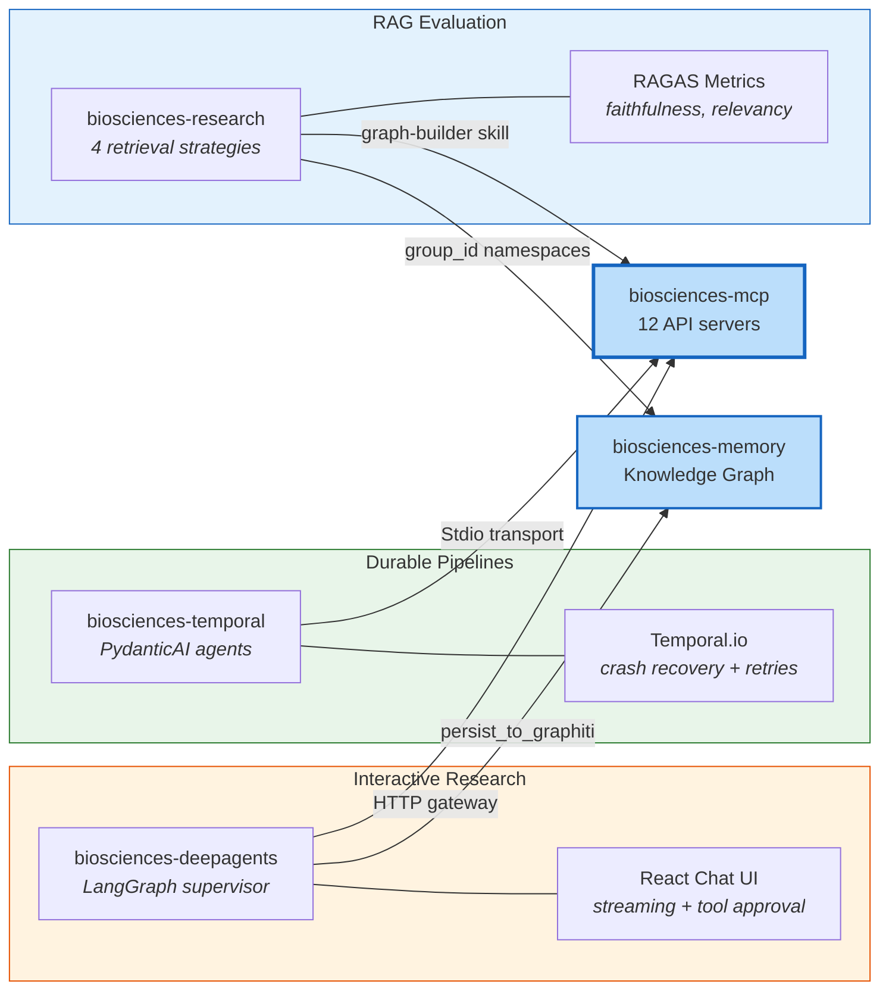

# Primary Data Flow — Open Biosciences

## Research Query Flow

The primary data flow through the platform follows the Fuzzy-to-Fact protocol across all orchestration systems.

## Three Orchestration Paths

The same Fuzzy-to-Fact flow is implemented in three different systems, each optimized for a different use case:

| Path | System | Use Case | LLM | Transport |
|------|--------|----------|-----|-----------|
| Interactive | biosciences-deepagents | Ad-hoc research with human-in-the-loop | gpt-4o | HTTP gateway |
| Durable | biosciences-temporal | Reproducible pipelines with crash recovery | gpt-4.1-mini | Stdio subprocess |
| Evaluation | biosciences-research | RAG strategy comparison + quality measurement | gpt-4.1-mini | Via graph-builder skill |
